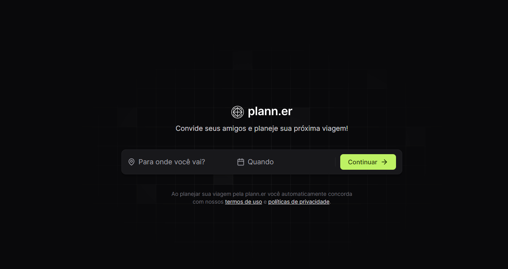

  

 

# Plann.er
Aplicação de um planejamento para viagens. 
O projeto será divido em duas partes: `Front-end` e `Back-end`

 
<h3 align="center">Desenvolvido em: </h3>

    
    
    
    
    

 

### 📘 Ferramentas/Bibliotecas utilizadas
  - Biblioteca para criação de interfaces: `reactJS`
  - Setup para criar o projeto no React: `ViteJS`
  - Layout: `tailwindcss`
  - Biblioteca de ícones: `react-icons`
  - Lib de navegação do projeto: `react-router-dom`

  ## ✔️ Autores

- [LucieneFreitas](https://github.com/LucieneFreitas)

## 📄 Referência

- [Rockeseat](https://www.rocketseat.com.br/)